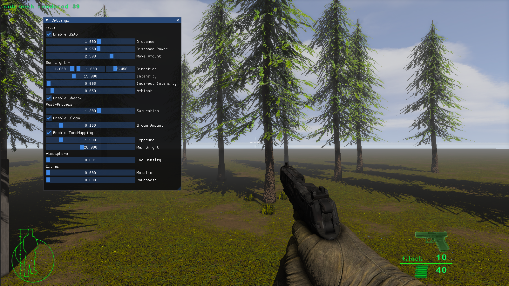

# Aronno Engine (Under Development...)

## A 3D Game Engine
Aronno Engine is a 3D game engine written in C++ and uses OpenGL 4.6 as its primary rendering API with a forward rendering system.
The main goal of this project was to utilize modern OpenGL features as much as possible. Even though the project is currenly focused on OpenGL, 
it is easily possible to add other rendering API such as Vulkan or DirectX since the codebase already follows abstract rendering context design.

## Currently Supported Features

1. Skeleton Animation
2. Keyframe Animation
3. Cascaded Shadow Map (For large Open-World game)
4. Screen-Space Ambient Occlusion
5. Bloom
6. Tone Mapping
7. HDR Rendering
8. SkyBox
9. Physically Based Rendering (PBR) Shader (in progress...)
10. Normal Mapping
11. Decals Rendering

